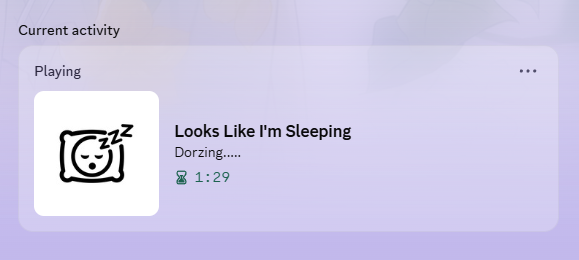

  
  <h2 align="center">ActivityPing</h2>
  

    
    
    
    
    
  

> Capture the app you are using, shape it with local rules, and publish a cleaner status to Discord.

ActivityPing is a local-first desktop activity relay for Discord Rich Presence. It captures app, title, and media context, then turns them into cleaner status text, artwork, buttons, and presets you can control yourself.

## Highlights

- 🖥️ Capture foreground app, window title, media metadata, paused media, and playback source
- 🧩 Build process-based rule groups with plain or regex title subrules and fallback text
- 🎛️ Publish through four Discord layouts: Smart, Music, App, and Custom
- 🔗 Attach buttons, party metadata, and join, spectate, or match secrets through rules or Custom mode
- 🖼️ Upload gallery images once and reuse them in Custom mode asset slots
- 🔍 Inspect the live runtime monitor, recent log feed, and exact Discord payload JSON
- 🙈 Control privacy with blacklist or whitelist filters, name-only masking, and media-source blocklists
- 🧰 Use tray integration, launch-on-startup, runtime autostart, and built-in platform self-test helpers

## Screenshots

<table>
  <tr>
    <td></td>
    <td></td>
  </tr>
  <tr>
    <td align="center"><strong>Live monitor, capture state, and runtime log</strong></td>
    <td align="center"><strong>RPC setup, reporting modes, and core settings</strong></td>
  </tr>
  <tr>
    <td colspan="2"></td>
  </tr>
  <tr>
    <td colspan="2" align="center"><strong>Detailed rule editor with filters, title subrules, and add-ons</strong></td>
  </tr>
</table>

<table>
  <tr>
    <td></td>
    <td></td>
    <td></td>
  </tr>
  <tr>
    <td align="center"><strong>App mode</strong></td>
    <td align="center"><strong>Music mode</strong></td>
    <td align="center"><strong>Smart mode with media</strong></td>
  </tr>
</table>

<table>
  <tr>
    <td></td>
    <td></td>
  </tr>
  <tr>
    <td align="center"><strong>Custom mode with custom text, artwork, and buttons</strong></td>
    <td align="center"><strong>Preset-driven Custom mode result</strong></td>
  </tr>
</table>

## What It Does

ActivityPing continuously reads:

- the current foreground process
- the current window title
- media metadata such as song, artist, album, duration, and source app

It then applies local rules and formatting before exposing the result in two places:

- the built-in live monitor
- Discord Rich Presence

That lets you keep raw activity private while still publishing a cleaner summary such as:

- `Writing release notes`
- `Reviewing pull requests`
- `Listening to Track Name`
- `Coding | VS Code`

## Platform Support

Foreground, window-title, and media detection are platform-specific.

- **Windows**
  - Foreground app and window title capture use native Win32 APIs.
  - Media capture uses the Windows Global System Media Transport Controls APIs.
  - No extra accessibility permission is required by the current implementation.
- **macOS**
  - Foreground app capture uses the native bridge.
  - Window title capture requires Accessibility permission.
  - Media capture requires `nowplaying-cli` (`brew install nowplaying-cli`).
- **Linux**
  - **X11**: foreground and title capture require `xprop`.
  - **GNOME Wayland**: requires `gdbus` and the [Focused Window D-Bus](https://extensions.gnome.org/extension/5592/focused-window-d-bus/) extension.
  - **KDE Plasma Wayland**: requires `kdotool`.
  - Media capture requires `playerctl` and an MPRIS-capable player.

Use the built-in self-test to confirm the current machine. For media checks, `No media is currently playing` is a normal result when playback is idle.

Detailed requirements:

- [Linux Foreground Detection Requirements](./docs/linux-wayland-foreground-bridge.md)
- [macOS Detection Requirements](./docs/macos-foreground-detection.md)
- [Windows Detection Requirements](./docs/windows-foreground-detection.md)

## Installation

1. Download the latest desktop build from [Releases](https://github.com/MoYoez/ActivityPing/releases).
2. Launch ActivityPing and save your Discord Application ID.
3. Choose a reporting mode, then start runtime.
4. If you want Discord images, configure an Artwork Uploader first.

**Configuration tip**

Discord Rich Presence image slots need public image URLs. Your app icons, album art, and gallery images are local files, so ActivityPing cannot send them to Discord directly. The Artwork Uploader converts those local images into reachable URLs for Discord to fetch.

If you only need text status, you can leave Artwork Uploader empty. If you want artwork enabled, see [Configuration and Runtime](./docs/configuration-and-runtime.md) or the [example uploader](./docs/examples/artwork_uploader_server.py).

## Reporting Modes

- **Smart**: prioritize the matched activity text, then optionally keep foreground app and active music context together
- **Music**: use a music-first layout with track, artist, album, playback progress, and source app
- **App**: focus on the foreground app and rule-resolved activity text
- **Custom**: edit `details` and `state` directly with tokens like `{activity}`, `{context}`, `{title}`, `{song}`, and `{artist}`, then save reusable presets

## Documentation

- [Documentation index](./docs/README.md)
- [Rules and Templates](./docs/rules-and-templates.md)
- [Configuration and Runtime](./docs/configuration-and-runtime.md)
- [Development notes](./docs/development.md)
- [Platform notes](./docs/platform-notes.md)
- [Linux Foreground Detection Requirements](./docs/linux-wayland-foreground-bridge.md)
- [macOS Detection Requirements](./docs/macos-foreground-detection.md)
- [Windows Detection Requirements](./docs/windows-foreground-detection.md)
- [Example artwork uploader](./docs/examples/artwork_uploader_server.py)

## License

This project is licensed under the [GNU General Public License v3.0](./LICENSE).

## Thanks

- [nowplaying-cli](https://github.com/kirtan-shah/nowplaying-cli)
- [mediaremote-adapter](https://github.com/ungive/mediaremote-adapter)
- [discord-music-presence](https://github.com/ungive/discord-music-presence)
- [waken-wa](https://github.com/MoYoez/waken-wa)
- [sleepy](https://github.com/sleepy-project/sleepy)
