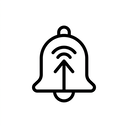
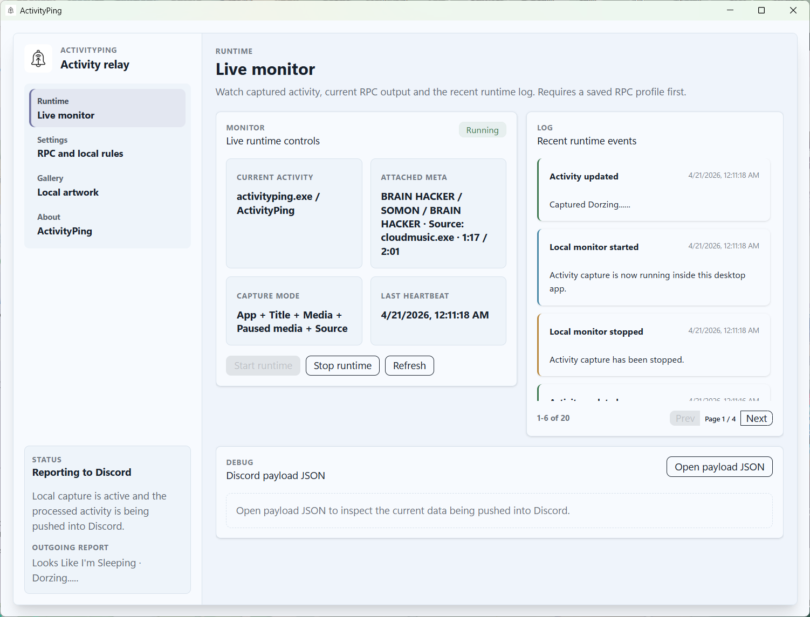
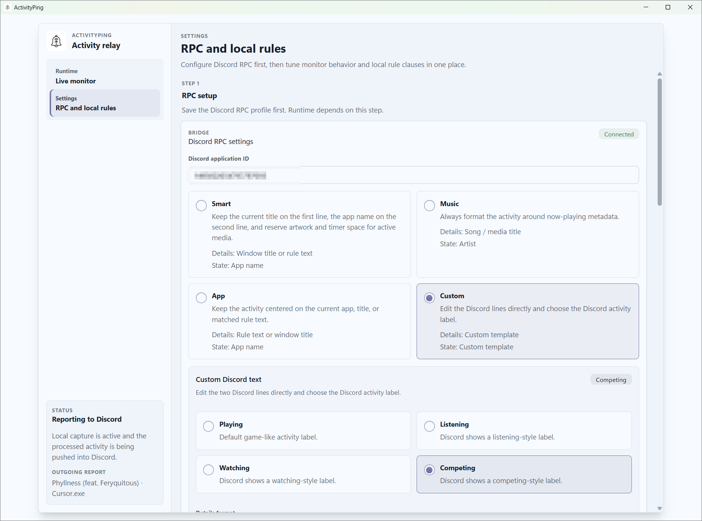
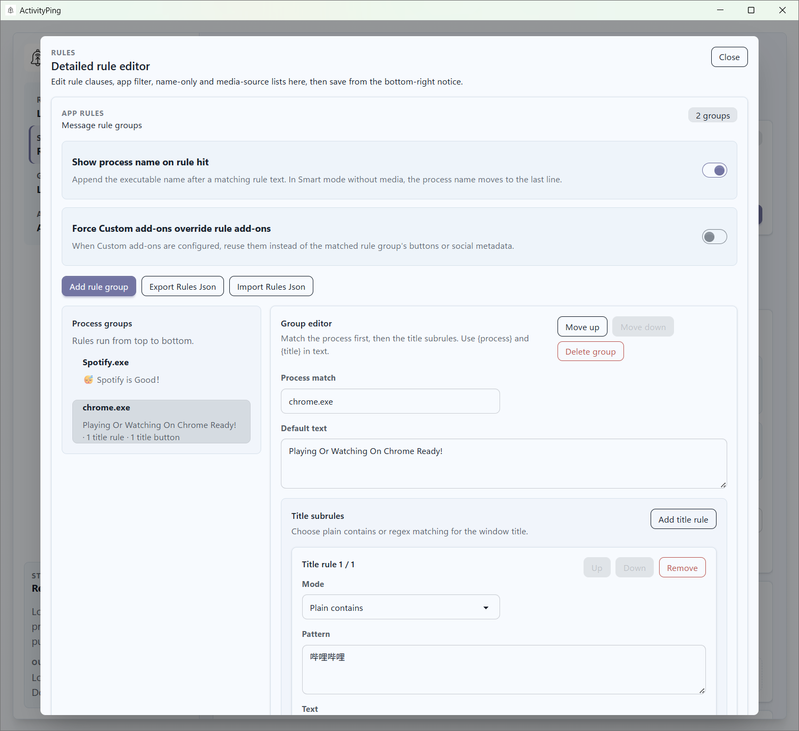
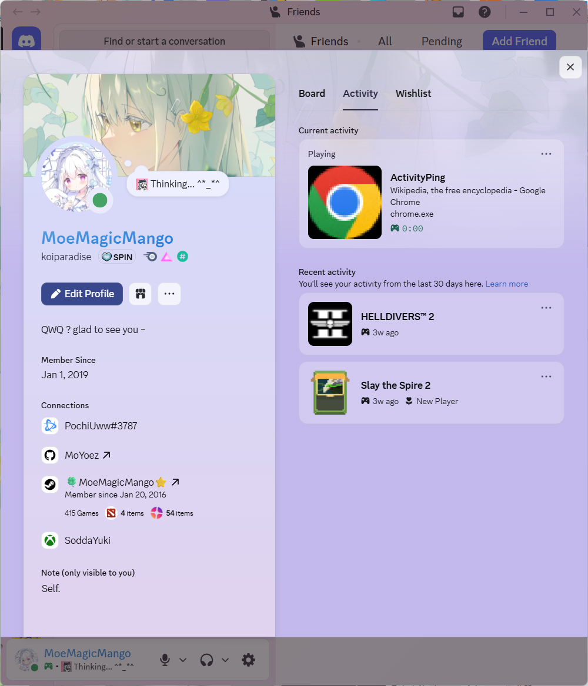
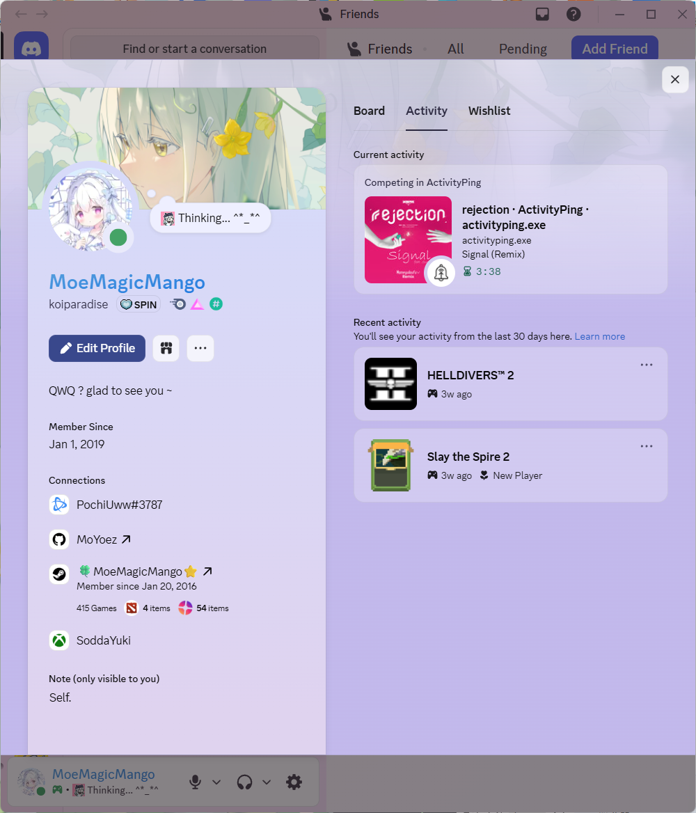
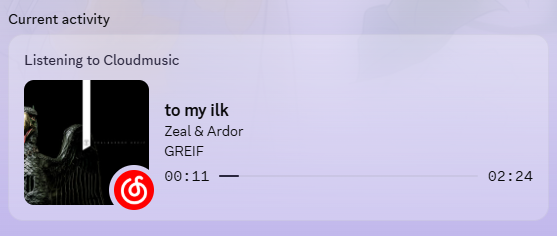
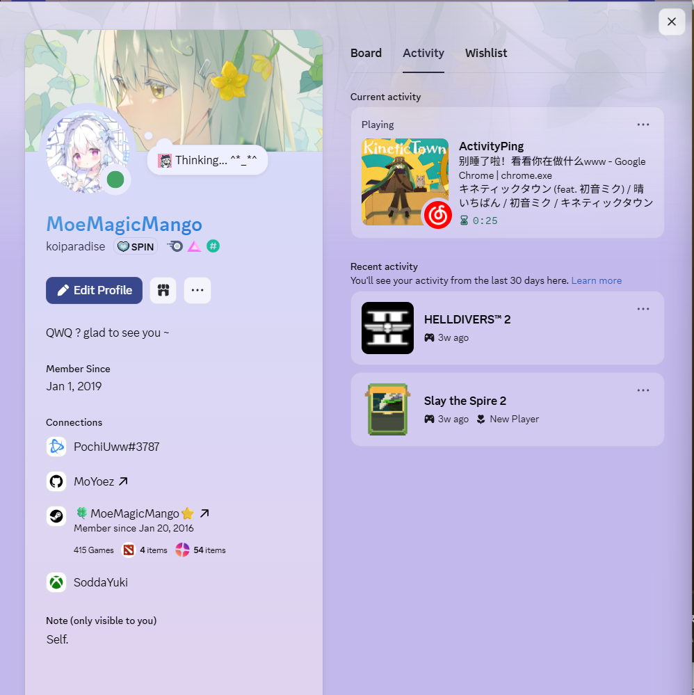

  

<h2 align="center">ActivityPing</h2>

  A desktop activity monitor for rule-based local reporting and Discord Rich Presence sync.

  
  
  
  

> Capture the app you are using, shape it with local rules, and publish a cleaner status to Discord.

ActivityPing is a Tauri desktop app that watches foreground apps, window titles, and media playback, then turns that data into a configurable local activity feed and Discord Rich Presence payload. It is designed for people who want more control than a one-size-fits-all reporter.

## Highlights ✨

1. 🧩 Rule-based activity resolution for apps, titles, and matched text
2. 🎛️ Four Discord output modes: Smart, Music, App, and Custom
3. 📡 Local runtime monitor with live status, logs, and payload inspection
4. 🚦 App blacklist and whitelist filters
5. 🙈 Name-only masking for privacy-sensitive apps
6. 🎵 Media source blocking for hiding selected playback providers
7. ✍️ Custom Discord templates with tokens like `{activity}`, `{context}`, and `{rule}`
8. 🖼️ Optional app icon and music artwork upload pipeline for Discord images
9. 🧰 Tray support, launch-on-startup, and runtime auto-start
10. 🩺 Platform self-test and permission helpers for desktop capture

## Gallery

<table>
  <tr>
    <td></td>
    <td></td>
  </tr>
  <tr>
    <td align="center"><strong>Runtime overview</strong></td>
    <td align="center"><strong>RPC and monitor settings</strong></td>
  </tr>
  <tr>
    <td colspan="2"></td>
  </tr>
  <tr>
    <td colspan="2" align="center"><strong>Rule group editor</strong></td>
  </tr>
</table>

<table>
  <tr>
    <td></td>
    <td></td>
    <td></td>
  </tr>
  <tr>
    <td align="center"><strong>App mode</strong></td>
    <td align="center"><strong>Custom Discord mode</strong></td>
    <td align="center"><strong>Music mode</strong></td>
  </tr>
</table>

  

<strong>Smart mode with music</strong>

## What It Does

ActivityPing continuously reads:

- the current foreground process
- the current window title
- media metadata such as song, artist, album, duration, and source app

It then applies local rules and formatting before exposing the result in two places:

- the built-in runtime monitor
- Discord Rich Presence

This lets you keep raw app activity private while still publishing a useful status like:

- `Writing release notes`
- `Reviewing PRs`
- `Listening to Track Name`
- `Coding | VS Code`

## Docs

- [Rules and Templates](./docs/rules-and-templates.md)
- [Development](./docs/development.md)
- [Configuration and Runtime](./docs/configuration-and-runtime.md)
- [Platform Notes](./docs/platform-notes.md)

## License

This project is licensed under the [GNU General Public License v3.0](./LICENSE).

## Thanks

- [nowplaying-cli](https://github.com/kirtan-shah/nowplaying-cli)
- [mediaremote-adapter](https://github.com/ungive/mediaremote-adapter)
- [discord-music-presence](https://github.com/ungive/discord-music-presence)
- [waken-wa](https://github.com/MoYoez/waken-wa) (My own project, main functions are based on this!)
- [sleepy](https://github.com/sleepy-project/sleepy) (Some call methods were referenced)
